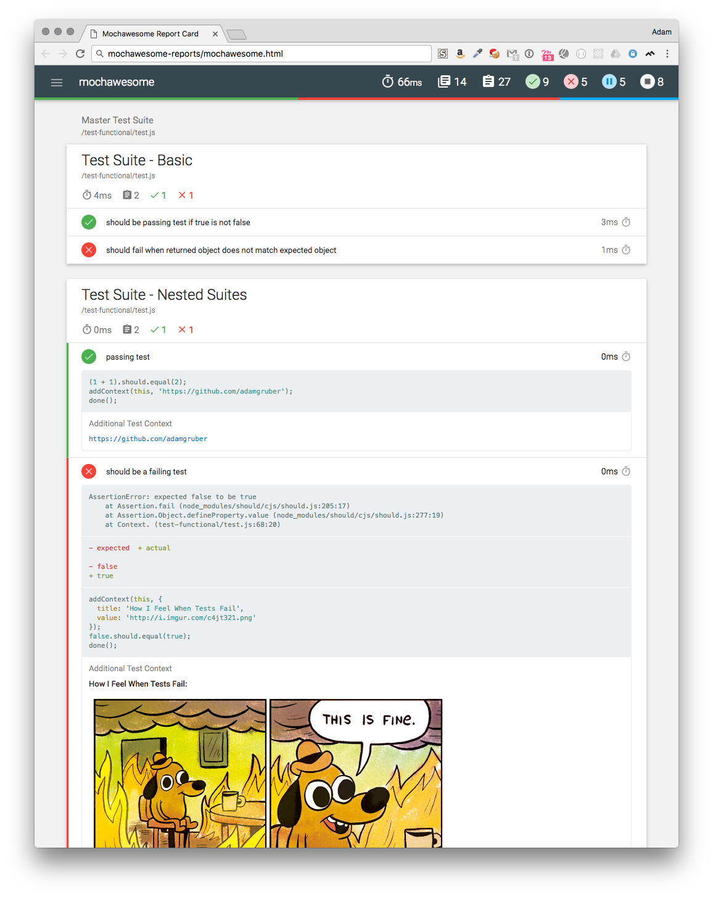

# AUTO-UPDATE-PROJECT-DEPENDENCIES #

This project is inspired from my internship.<br>
The aim of the project is to update specified dependencies of several repositories automatically at the same time. All updated projects are located at `./projects-to-update`.
It can do several validations for an updated project: `npm ls`, `npm audit`, running unit tests and component tests by `mocha`.When the update and validation are finished, an updated project will be pushed to a new branch.

Script | Description
--- | ---
`updateProjectDependencies.js` | Update dependencies for projects that are specified at `config.js`.

## Command Line Configuration ##
`npm ls` , `npm audit`, unit tests and component tests are run for updated projects by default.
However, you can skip either unit tests or component tests.<br>
Git clone configuration is the option that you can choose the way you like to clone projects. Please note that it is a mandatory.  

````
Basic configuration:
--no-t,--no-unitTest              Disable unit tests
--no-c,--no-componentTest         Disable component tests

Git clone configuration:
--SSH                             Use SSH to clone projects
--HTTPS                           Use HTTPS to clone projects

````

## Set up Config.js ##
Add packages you want to update for projects to the `packageInfo`.
```javascript
const packageInfo = [{ packageName: 'package' } ];
```
Add projects to be updated automatically to the `projectsToUpdate`.
```javascript
const config = {
    // ...
    projectsToUpdate: [{ name: 'projects' }]
    // ...
};
```

## Result ##
These results are inside the folder that contains `package.json` in each updated projects and will not be commited to the new branch. <br> 
PS: They are not be committed to the new branch because they will not be kept up to date by the target project.

Name | Description
--- | ---
npm-ls-result.txt|The result of running `npm ls`.
npm-audit.html|The result of running `npm audit --audit-level=high `. 
test-reports|It contains results of unit tests and component tests.
updateSummary|It is at the root of an updated project. It records the details of the update.

### Example of a npm-audit.html

It is supported by `npm-audit-html`.


### Example results of unit tests

It is supported by `mochawesome`.
Results of component tests share the same format.



### Output

After the update is finished, there will be a summery to describe which projects receive updates and which projects fail.

```
Here is the summary of the automated dependencies update:
- The project receive updates: sample1
- The project has no dependencies eligble to be automatically updated: sample2

```

## After the update
An updated project would be committed to a new branch. This new branch will be opened in your web browser after the update is done.


